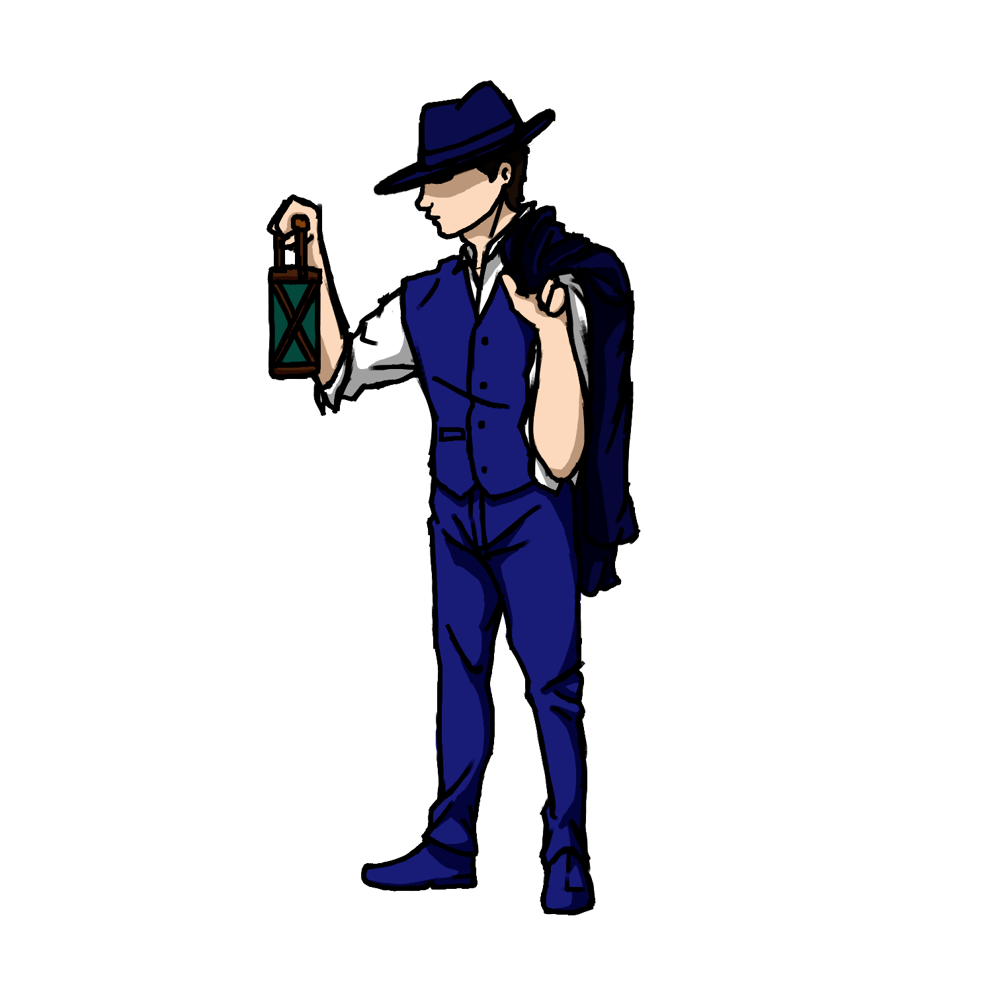
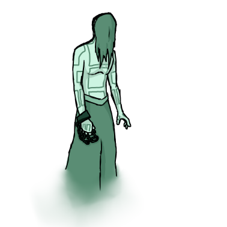

   

   

  <a aria-label="Completed" href="https://globalgamejam.org/">
    </img>
  </a>

  

  A new game. Make with ❤︎ for our
        <a href="#Team">Team</a> 
    </a>
  

this is our first game jam to test our skills in making game. we have so problems to start because a litle personal thing that happens but now is going on.

# Proposal
the idea of the game jam of this is work with the thema of duality, because of that we resolve to work in a coop game about the life and dead through the face of a medium and a ghost.
## Medium - by Iago

## Ghost - by Iago

# Team

* <a href="https://www.linkedin.com/in/luiz-lima-cezario/">Luiz Lima Cezario</a> - Game Dev 
* <a href="">Nicolas Martins</a> - Game Dev
* <a href="">Thaí Takashi</a> - Game Dev
* <a href="https://www.linkedin.com/in/iago-lima-p/">Iago Lima Pinto</a> - Design Game
* <a href="https://www.linkedin.com/in/iago-lima-p/">Henrique Takashi</a> - Design Game
