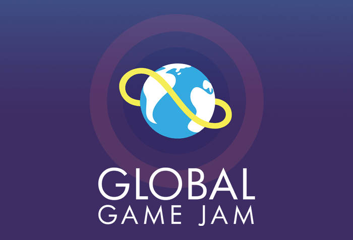

   

	
   

  <a aria-label="Completed" href="https://globalgamejam.org/">
    </img>
  </a>
   

  

  ft_printf of 42. Make with ❤︎ for
        <a href="https://github.com/luizlcezario">Luiz Cezario</a> 
    </a>
  

this is our first game jam to test our skills in making game. we have so problems to start because a litle personal thing that happens but now is going on.

